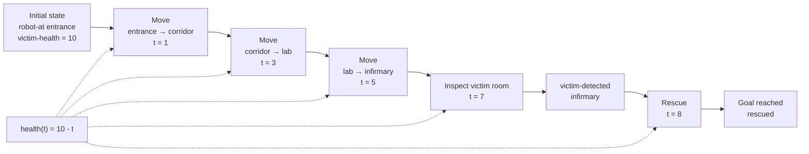

# Q2 Planner Visualization — Fast Rescue

<!--
This note explains how to read the ENHSP / VS Code planner visualization.
It does not replace the PDDL+ domain, problem, or planner output.
It provides a cleaner interpretation for report and exam preparation.
-->


The ENHSP planner visualization for PDDL+ can be hard to read.

In the fast rescue case, the textual planner output may show only a partial plan, while the graphical timeline shows that the rescue phase is reached around `t = 8`.

This note reconstructs the intended timeline from the validated model.

---

## Clean timeline

| Time | Planner step | Meaning | Expected health |
|---:|---|---|---:|
| `t = 0` | Initial state | Robot at `entrance`, victim in `infirmary`, health starts at `10` | `10` |
| `t = 1` | `start-move entrance corridor` | Robot starts moving from entrance to corridor | `9` |
| `t = 3` | `start-move corridor lab` | Robot starts moving from corridor to lab | `7` |
| `t = 5` | `start-move lab infirmary` | Robot starts moving from lab to infirmary | `5` |
| `t = 7` | `start-inspect-victim-room infirmary` | Robot inspects the victim room and detection becomes possible | `3` |
| `t = 8` | `start-rescue infirmary` | Robot starts rescue before health reaches zero | `2` |

---

## Causal interpretation



---

## Health interpretation

Victim health starts at:

```txt
victim-health = 10
```

The PDDL+ process decreases health at rate `1` per time unit:

```txt
health(t) = 10 - t
```

Therefore, when rescue starts:

```txt
health(8) = 10 - 8 = 2
```

Since health is still positive at `t = 8`, the fast rescue succeeds.

---

## Why the planner output is confusing

The Q2 model uses a PDDL+ pattern:

```txt
start action
process updates activity-progress
finish event completes the action
```

Actions such as `start-move` are selected by the planner.

Events such as `finish-move`, `finish-inspect-victim-room`, and `finish-rescue` are triggered automatically by the world when their preconditions become true.

This is why the graphical planner output may show a partial or unintuitive representation.
