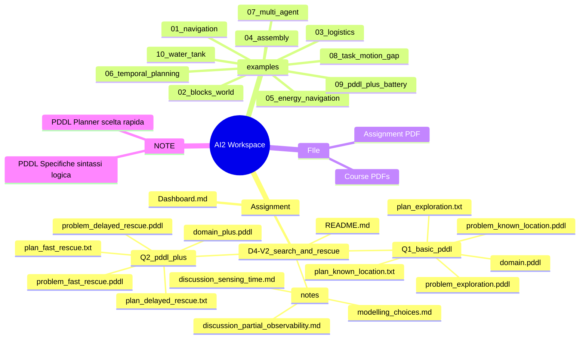

# 🚑 AI2 Assignment Dashboard — D4-V2

> **Scenario:** rescue robot in damaged building, topology known, victim location unknown.  
> **Core problem:** the robot must explore, inspect rooms, detect the victim, then rescue.

---
## 1. Total Progress

```dataviewjs
const current = dv.current();
const file = app.vault.getAbstractFileByPath(current.file.path);

if (!file) {
  dv.paragraph("⚠️ File not found by Dataview.");
} else {
  const text = await app.vault.read(file);

  function getSection(source, title) {
    const lines = source.split(/\r?\n/);
    const start = lines.findIndex(line =>
      new RegExp("^##\\s+\\d+\\.\\s+" + title + "\\s*$").test(line.trim())
    );

    if (start === -1) return "";

    let end = lines.length;
    for (let i = start + 1; i < lines.length; i++) {
      if (/^##\s+\d+\.\s+/.test(lines[i].trim())) {
        end = i;
        break;
      }
    }

    return lines.slice(start + 1, end).join("\n");
  }

  const workingPlan = getSection(text, "Working Plan");

  const taskLines = workingPlan
    .split(/\r?\n/)
    .filter(line => /^\s*[-*]\s+\[[ xX]\]\s+/.test(line));

  const total = taskLines.length;
  const done = taskLines.filter(line => /^\s*[-*]\s+\[[xX]\]\s+/.test(line)).length;

  const percent = total === 0 ? 0 : Math.round((done / total) * 100);
  const blocks = 20;
  const filled = total === 0 ? 0 : Math.round((done / total) * blocks);
  const bar = "█".repeat(filled) + "░".repeat(blocks - filled);

  dv.paragraph(`**${done} / ${total} tasks completed**`);
  dv.paragraph(`\`${bar}\` **${percent}%**`);
}
```

---

---
## 2. Design Map



---
## 3. Assignment Scope

```dataviewjs
const current = dv.current();
const file = app.vault.getAbstractFileByPath(current.file.path);

if (!file) {
  dv.paragraph("⚠️ File not found by Dataview.");
} else {
  const text = await app.vault.read(file);

  function getSection(source, title) {
    const lines = source.split(/\r?\n/);
    const start = lines.findIndex(line =>
      new RegExp("^##\\s+\\d+\\.\\s+" + title + "\\s*$").test(line.trim())
    );

    if (start === -1) return "";

    let end = lines.length;
    for (let i = start + 1; i < lines.length; i++) {
      if (/^##\s+\d+\.\s+/.test(lines[i].trim())) {
        end = i;
        break;
      }
    }

    return lines.slice(start + 1, end).join("\n");
  }

  const workingPlan = getSection(text, "Working Plan");

  const taskLines = workingPlan
    .split(/\r?\n/)
    .filter(line => /^\s*[-*]\s+\[[ xX]\]\s+/.test(line))
    .map(line => ({
      text: line.replace(/^\s*[-*]\s+\[[ xX]\]\s+/, ""),
      done: /^\s*[-*]\s+\[[xX]\]\s+/.test(line)
    }));

  function progressFor(keywords) {
    const selected = taskLines.filter(t =>
      keywords.some(k => t.text.toLowerCase().includes(k.toLowerCase()))
    );

    const total = selected.length;
    const done = selected.filter(t => t.done).length;

    const status =
      total === 0 ? "—" :
      done === 0 ? "⬜" :
      done < total ? "🟨" :
      "✅";

    const pct = total === 0 ? "—" : `${Math.round((done / total) * 100)}%`;

    return [status, `${done}/${total}`, pct];
  }

  dv.table(
    ["Part", "Output required", "Status", "Progress", "%"],
    [
      ["Setup", "Project structure + README skeleton", ...progressFor(["assignment text", "folder structure", "explicit knowledge", "README skeleton"])],
      ["Q1", "Basic PDDL model", ...progressFor(["domain.pddl", "move", "inspect", "detect", "rescue"])],
      ["Q1", "Problem instances", ...progressFor(["problem_known_location.pddl", "problem_exploration.pddl"])],
      ["Q1", "Valid plans", ...progressFor(["run Q1 planner", "plan_known_location.txt", "plan_exploration.txt"])],
      ["Q2", "PDDL+ model with health degradation", ...progressFor(["victim-health", "health degradation", "failure event", "discovery event"])],
      ["Q2", "Delay experiment", ...progressFor(["problem_fast_rescue.pddl", "problem_delayed_rescue.pddl", "plan_fast_rescue.txt", "plan_delayed_rescue.txt", "delay affects rescue success"])],
      ["Testing", "Validation checks", ...progressFor(["syntax", "all problem files", "every plan", "rescue", "unknown-location", "PDDL+ model"])],
      ["Discussion", "Partial observability + sensing/time", ...progressFor(["classical PDDL", "sensing", "time-dependent"])],
      ["Final", "README + cleanup + push", ...progressFor(["final README", "clean repo", "final commit"])],
    ]
  );
}
```

---
## 4. Working Plan

### Phase 0 — Setup and requirements

- [x] Read assignment text carefully.
- [x] Create project folder structure.
- [x] Decide what is explicit knowledge and what is approximated.
- [x] Create initial README skeleton.

### Phase 1 — Q1 Basic PDDL

- [ ] Define `domain.pddl`.
- [ ] Define action `move`.
- [ ] Define action `inspect`.
- [ ] Define action `detect` or merge detection into `inspect`.
- [ ] Define action `rescue`.
- [ ] Create `problem_known_location.pddl`.
- [ ] Create `problem_exploration.pddl`.
- [ ] Run Q1 planner on both problems.
- [ ] Save `plan_known_location.txt`.
- [ ] Save `plan_exploration.txt`.
- [ ] Explain why classical PDDL only approximates unknown victim location.

### Phase 2 — Q2 PDDL+

- [ ] Add numeric fluent: `(victim-health)`.
- [ ] Add process: victim health degradation over time.
- [ ] Add failure event: victim dies / rescue fails when health reaches zero.
- [ ] Add discovery event or discovery logic.
- [ ] Create `problem_fast_rescue.pddl`.
- [ ] Create `problem_delayed_rescue.pddl`.
- [ ] Show how delay affects rescue success.
- [ ] Save `plan_fast_rescue.txt`.
- [ ] Save `plan_delayed_rescue.txt`.

### Phase 3 — Testing and validation

- [ ] Check syntax with VS Code PDDL extension.
- [ ] Run all problem files again from clean terminal.
- [ ] Confirm every plan reaches the goal.
- [ ] Check that `rescue` cannot happen before `inspect/detect`.
- [ ] Check that unknown-location version does not assume the victim location directly.
- [ ] Check that PDDL+ model shows time/health interaction.
- [ ] Check that plan files are non-empty and correspond to the right problem file.
- [ ] Check that notes match the actual predicates/actions used in the code.

### Phase 4 — Final write-up

- [ ] Explain modelling choices.
- [ ] Explain limitations of classical PDDL.
- [ ] Explain why sensing is approximated with explicit predicates.
- [ ] Explain how PDDL+ adds time-dependent health degradation.
- [ ] Update final README after validation.
- [ ] Clean repo.
- [ ] Final commit and push.

---
## 5. Core Modelling Decisions

| Decision               | Choice                                                                | Reason                                                          |
| ---------------------- | --------------------------------------------------------------------- | --------------------------------------------------------------- |
| Workspace              | `/home/ruggio/Documents/UniGe/AI2`                                    | Current root folder                                             |
| Dashboard location     | `/home/ruggio/Documents/UniGe/AI2/Assignment/Dashboard.md`            | Dashboard now lives inside `Assignment/`, not in workspace root |
| Assignment folder      | `/home/ruggio/Documents/UniGe/AI2/Assignment/D4-V2_search_and_rescue` | Current actual assignment path                                  |
| Course examples folder | `/home/ruggio/Documents/UniGe/AI2/examples`                           | Reference implementations from the exercises                    |
| Course files folder    | `/home/ruggio/Documents/UniGe/AI2/FIle`                               | PDFs and assignment statement                                   |
| Notes folder           | `/home/ruggio/Documents/UniGe/AI2/NOTE`                               | General PDDL notes outside assignment                           |
| Robot count            | Single robot                                                          | Required by assignment                                          |
| Topology               | Known graph                                                           | Environment topology is known                                   |
| Victim location        | Not assumed in exploration instance                                   | Required by “unknown victim location”                           |
| Exploration            | `move` + `inspect`                                                    | Inspection must be explicit                                     |
| Detection              | Predicate updated after inspection                                    | Detection must influence later actions                          |
| Rescue                 | Only after victim is found                                            | Prevents invalid direct rescue                                  |
| Q2 time pressure       | Health decreases continuously                                         | Required PDDL+ process                                          |
| Failure                | Event when health reaches 0                                           | Models late rescue failure                                      |

---
## 6. Test Matrix

| Test                      | Expected result                              | Status |
| ------------------------- | -------------------------------------------- | -----: |
| Q1 known-location problem | Planner moves to victim room and rescues     |      ⬜ |
| Q1 exploration problem    | Planner visits/inspects rooms before rescue  |      ⬜ |
| Rescue before detection   | Must be impossible                           |      ⬜ |
| Missing connection        | Planner should fail or choose another path   |      ⬜ |
| Q2 fast rescue            | Victim survives                              |      ⬜ |
| Q2 delayed rescue         | Failure/delay effect is visible              |      ⬜ |
| README matches code       | No mismatch between explanation and files    |      ⬜ |
| Notes match code          | Notes describe actual domain/problem choices |      ⬜ |

---
## 7. Actual Repository Structure

```txt
AI2/
├── Assignment/
│   ├── D4-V2_search_and_rescue/
│   │   ├── notes/
│   │   │   ├── discussion_partial_observability.md
│   │   │   ├── discussion_sensing_time.md
│   │   │   └── modelling_choices.md
│   │   ├── Q1_basic_pddl/
│   │   │   ├── domain.pddl
│   │   │   ├── plan_exploration.txt
│   │   │   ├── plan_known_location.txt
│   │   │   ├── problem_exploration.pddl
│   │   │   └── problem_known_location.pddl
│   │   ├── Q2_pddl_plus/
│   │   │   ├── domain_plus.pddl
│   │   │   ├── plan_delayed_rescue.txt
│   │   │   ├── plan_fast_rescue.txt
│   │   │   ├── problem_delayed_rescue.pddl
│   │   │   └── problem_fast_rescue.pddl
│   │   └── README.md
│   └── Dashboard.md
├── examples/
├── FIle/
└── NOTE/
```

---
## 8. Final Submission Checklist

- [ ] Q1 domain file present.
- [ ] Q1 known-location problem present.
- [ ] Q1 exploration problem present.
- [ ] Q1 plans saved.
- [ ] Q2 PDDL+ domain present.
- [ ] Q2 fast-rescue problem present.
- [ ] Q2 delayed-rescue problem present.
- [ ] Q2 plans saved.
- [ ] Notes folder present.
- [ ] Discussion: classical PDDL and partial observability.
- [ ] Discussion: sensing and time.
- [ ] Modelling choices note present.
- [ ] Dashboard moved inside `Assignment/`.
- [ ] Verify Q2 process for victim health in `domain_plus.pddl`.
- [ ] Verify Q2 discovery/failure event in `domain_plus.pddl`.
- [ ] Verify delay comparison in notes or README.
- [ ] README explains how to run the files.
- [ ] Repository is clean.
- [ ] Final commit pushed.

---
## 9. Commands

### Show current tree

```bash
cd /home/ruggio/Documents/UniGe/AI2 && \
tree -a -I '.git|__pycache__|.venv|venv|node_modules|.obsidian|*.pyc' .
```

### Check assignment files

```bash
cd /home/ruggio/Documents/UniGe/AI2 && \
find Assignment/D4-V2_search_and_rescue -type f | sort
```

### Preview plans

```bash
cd /home/ruggio/Documents/UniGe/AI2 && \
for f in Assignment/D4-V2_search_and_rescue/Q1_basic_pddl/plan_*.txt Assignment/D4-V2_search_and_rescue/Q2_pddl_plus/plan_*.txt; do
  echo ""
  echo "--- $f ---"
  sed -n '1,80p' "$f"
done
```

### Check PDDL constructs

```bash
cd /home/ruggio/Documents/UniGe/AI2 && \
grep -RInE '^\s*\(:action|^\s*\(:durative-action|^\s*\(:process|^\s*\(:event' Assignment/D4-V2_search_and_rescue
```

### Replace dashboard in the workspace

```bash
cp /path/to/new/Dashboard.md /home/ruggio/Documents/UniGe/AI2/Assignment/Dashboard.md
```